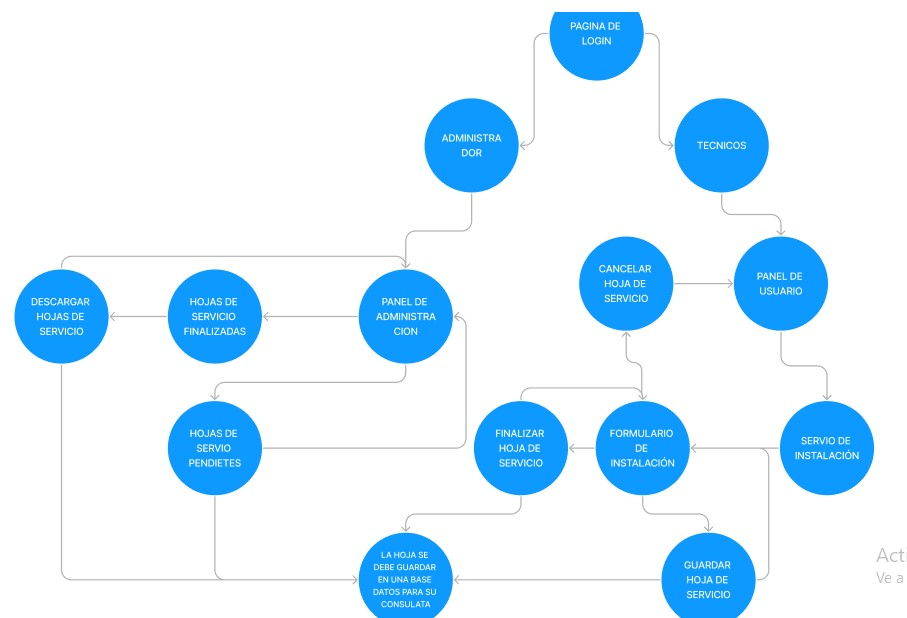
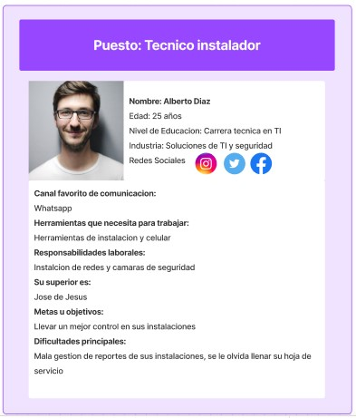

# LauncheX_practica_FrontEnd
LauncheX_Hojas_de_Servicios

<h1> 1.	DESCRIPCION GENERAL DEL REQUERIMIENTO </h1>
 
<h3> PROYECTO REPORT SERVIS </h3>
 
<h4>Descripción de la Solicitud</h4>
Usuario Solicitante: 
 
 
Se requiere una plataforma web donde se pueda levantar hojas de servicio de instalación de cámaras, red y paneles solares, servicios realizados por los técnicos, y un panel de administración donde se puedan ver los servicios concluidos y los servicios pendientes
 
 
Líder Funcional:
 
 
Se requiere una plataforma web donde los técnicos den de alta hojas de servicio de sus instalaciones, las cuales son 3 cámaras, redes y paneles solares, se deben agregar campos de fecha, nombre del cliente, tipo de instalación, campo de materiales donde el técnico agregara una descripción del material que utilizo, campo de observaciones, domicilio del cliente, nombre del técnico a cargo, y si por algún motivo no se llevó acabo el servicio se debe agregar un campo con opciones de por qué no se realizó el servicio, también se agregaran botones como guardar, finalizar servicio, los servicios se deben poder consultar desde el panel de administración, los servicios guardados deben irse a pendientes y los servicios finalizados a la sección de servicios finalizados donde se podrá descargar en PDF el servicio que se finalizó.
 
 

 
 
<h4> TÉRMINOS DE REFERENCIA </h4>
 
Alcance de la solución 
 
La solución debe ayudar a llevar un mejor control en los servicios que ofrece la empresa, llevando un control de los servicios realizados y los que están pendientes, este proyecto no ara que el servicio técnico en sitio sea más eficiente solo se pretende llevar un mejor control de lo que se hace y lo que se deja pendiente.
 
 
Requerimientos funcionales y criterios de aceptación 
 
Revisión el usuario pretende encontrar un formulario de fácil compresión y llenado, el área de administración, llevar un mejor control de los servicios terminados y una fácil lectura del servicio realizado
 
 
<h1> 2. BUYER PERSONA </h1>
 

